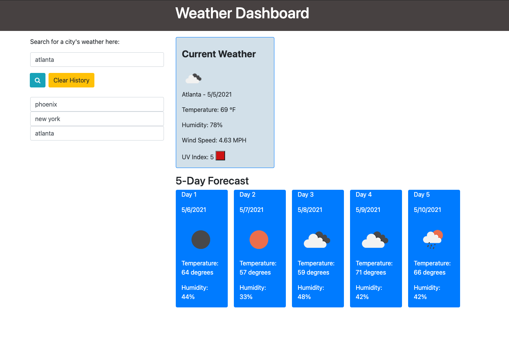

# Weather-Dashboard

## Goal:

Create a Weather Dashboard using Javascript/jquery/local storage concepts.

## User Story:

* As a user looking for the weather in a particular city, I would like to be able to search for a city in the search bar and display the weather. 

* Upon typing a city name and clicking on the search button, I will see the searched city's current date, temperature (Farenheit), humidity, wind speed, and UV index. The 5-day forecast will also be displayed, showing the dates, temperature (Farenheit), and humidity. 

* Current searches will be saved beneath the search bar until window is closed, or user can hit the Clear History button to remove the saved cities.

API keys used:

* [Open Weather Current Weather ](https://openweathermap.org/current)

* [Open Weather 5 Day Forecast](https://openweathermap.org/forecast5)

## Deployment

Page is deployed using [GitHub](https://sarahbinaz1020.github.io/Weather-Dashboard/index.html)

## Future Development

Currently recreating using React.

## Questions

If you have any questions about the repo, open an issue or contact me directly at sarahbinaz1020@gmail.com. You can find more of my work at [Sarah Bonnell](https://github.com/sarahbinaz1020/).

